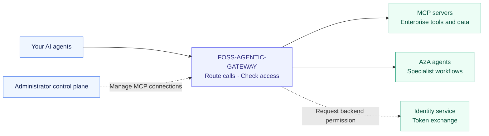
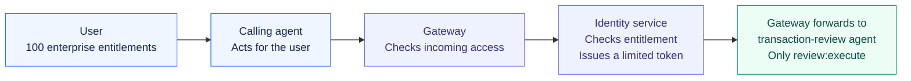
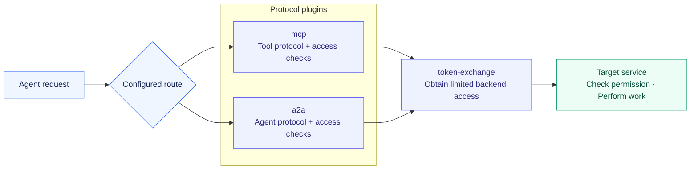

# FOSS-AGENTIC-GATEWAY

**An open foundation for connecting AI agents and tools—and building what comes next.**

Agent ecosystems grow when people can build on each other's work. FOSS-AGENTIC-GATEWAY makes the connection layer something we can build together: reusable plugins for tool access, agent collaboration, and limited backend permissions.

Use it to connect your own agents. Study and adapt the source. Contribute a capability that other teams can reuse. The project is Apache-2.0 licensed, runs on Kong Gateway OSS, and gives contributors a working gateway, SDK, and examples to build on.

[Try the banking examples](examples/banking/README.md) · [Deploy the gateway](docs/gateway/setup.md) · [Set up the control plane](docs/control-plane/setup.md) · [Browse the docs](docs/README.md) · [Contribute](CONTRIBUTING.md)

## Why build this together?

As AI agents become part of enterprise workflows, they need to call tools and collaborate with other agents. Each new connection brings access rules, credentials, and integration work. Maintaining that work separately in every agent becomes harder as the number of agents and services grows.

FOSS-AGENTIC-GATEWAY brings those shared concerns into one place. It combines tool access through MCP, agent collaboration through A2A, and backend access through OAuth token exchange. Teams can connect a new service and configure its access policy while keeping agents focused on their business workflows.

For the open-source community, the opportunity is to turn solutions built for one deployment into capabilities others can use. A better access policy, a new routing strategy, or an interoperability fix can become a focused contribution to the shared gateway.

The project builds on Kong Gateway OSS and OpenResty, with three project plugins, an administrator control plane, a Python SDK, and runnable examples. You can start with one component and help it grow.



## What is in it for the open-source community?

- **Reusable building blocks.** Use and adapt the MCP, A2A, and token-exchange plugin source under Apache-2.0. These project plugins require no Kong Enterprise license.
- **A place for focused contributions.** Improve one plugin or add a new one, with shared examples and CI to exercise it in a working gateway.
- **Choice across agent stacks.** Work with open protocols and configurable identity services, so a contribution can serve more than one vendor's ecosystem.
- **More than code contributions.** Bring an interoperability report, a deployment guide, an SDK improvement, or an example from your domain.

### How does this relate to Kong's plugin ecosystem?

Kong's plugin catalog includes OSS plugins, third-party plugins, and features requiring commercial licenses. Availability depends on the plugin and gateway version. For example, Kong's [OpenID Connect plugin](https://developer.konghq.com/plugins/openid-connect/) is marked Enterprise-only, while [AI Proxy Advanced](https://developer.konghq.com/plugins/ai-proxy-advanced/) requires an AI license.

This project adds its own open `mcp`, `a2a`, and `token-exchange` plugins to Kong OSS. Their source is available here for Kong OSS users to inspect, adapt, and install with the required dependencies. The supplied image includes them alongside the OSS release's bundled plugins. You can configure compatible OSS plugins as well; additional plugins need compatibility and ordering checks. Check the [Kong Plugin Hub](https://developer.konghq.com/plugins/) for each upstream plugin's availability.

Our plugins are distributed through this repository and its gateway image; they have not been published to Kong's Plugin Hub. This project does not grant access to Kong's licensed plugins.

## What this gives your enterprise

| Benefit | What it means for your teams |
| --- | --- |
| Simpler connections | Agents use gateway addresses; internal service locations stay in gateway configuration. |
| Consistent access checks | Each endpoint has a policy defining who may call it and what permission is required. |
| Limited downstream access | Exchange a caller's broad access for a token restricted to the target service and its configured permissions. |
| Fewer backend credentials in agents | Agents hold their own credentials; the gateway obtains access for internal services. |
| Flexible adoption | Enable the plugins needed for each route and add connections as your workflows grow. |
| Ownership and choice | Host the gateway yourself, use open protocols, and configure your identity provider. |

## Token exchange: give each target only what it needs

A user may have **100 entitlements** across the enterprise. A transaction-review agent may need **just one**: permission to review a transaction. Passing all the user's permissions to that agent would give it more access than its task requires.

Token exchange lets the gateway request a separate token for that target, with only the configured permission. This narrowing of access is called **downscoping**.



The identity service must verify that the caller is entitled to the requested permission. The target checks the new token before doing any work. Permissions for payments, customer administration, and other services stay out of the token sent to the transaction-review agent.

With the appropriate identity policy, the target can also identify the original caller and the gateway acting for it. Each service gets its own permission; access to accounts does not automatically grant access to transactions.

Exchange works with both MCP and A2A. It is optional in the base gateway and required by the banking examples. Today, requested permissions are configured per route; the identity service owns entitlement decisions. See the [token-exchange guide](docs/plugins/token-exchange.md) for setup and enforcement details.

## A flexible plugin architecture

Different connections need different behavior. A tool server needs MCP handling; another agent needs A2A handling. Either connection can use the same token-exchange capability.

The gateway composes these capabilities on each route:



*This diagram shows routes with token exchange enabled. Routes can also use a protocol plugin without exchange.*

| Plugin | Responsibility | Where it fits |
| --- | --- | --- |
| `mcp` | Handle tool traffic and verify incoming access | Agent → MCP server |
| `a2a` | Handle agent traffic and verify incoming access | Agent → agent, over JSON-RPC or REST |
| `token-exchange` | Obtain a separate token for the backend | Shared by either route type |

Plugins have distinct responsibilities and are enabled through configuration. Token exchange uses a shared authentication contract rather than depending on MCP or A2A internals. This allows the protocol handling and identity behavior to evolve separately.

Developers can extend the gateway through Kong's plugin mechanism. Additional plugins require implementation, inclusion in the gateway image, configuration, and testing. The current built-in project plugins are `mcp`, `a2a`, and `token-exchange`.

## Could you contribute automatic LLM routing? Yes.

Suppose a workflow should choose a model based on cost, response time, task capability, or where data is allowed to run. A contributor could build an LLM-routing plugin that makes that choice from configured, approved providers. “Best” would mean best for that deployment's policy and measured results.

For example: send a simple summary to a lower-cost model, choose a model evaluated for a demanding task, and keep sensitive requests on an approved local model.

**This is a contribution idea, not an implemented feature.** The gateway currently routes MCP and A2A traffic to configured services. An LLM-routing extension would introduce explicit model-call routes and provider handling, with tests for model selection, credentials, streaming, and failure behavior. Existing MCP and A2A calls would retain their own endpoint and access policies.

| Ideas we can build together | What a contribution could enable |
| --- | --- |
| Automatic LLM routing | Select among approved models using cost, latency, capability, and data-location policy. |
| Agent and tool discovery | Help callers find approved services as the catalog grows. |
| Agent-aware observability | Show which service was called, how long it took, and whether it succeeded. |
| Richer administration | Manage A2A and token-exchange configuration through the control plane. |
| More SDKs and examples | Make gateway integration easier in other languages and domains. |

*These are invitations for discussion and contributions, not shipped capabilities or a committed delivery schedule.*

[Open a proposal](https://github.com/sanketrk/FOSS-AGENTIC-GATEWAY/issues/new) describing the problem you want to solve, or start with the [contribution guide](CONTRIBUTING.md). A small, useful contribution is a good place to begin.

## See it work: a banking workflow

A banking assistant needs an account summary and help understanding a recent purchase. Through the gateway, it:

1. Calls the accounts MCP server for an account summary.
2. Calls the transactions MCP server for recent transactions.
3. Calls a transaction-review agent over A2A to summarize the purchase.

Each target receives a separate token with its configured permission. The runnable examples include **four standalone components**—two agents and two MCP servers—plus a local identity service, TLS, and token exchange. They use synthetic data. The calling agent demonstrates both A2A JSON-RPC and REST.

[Run the banking examples →](examples/banking/README.md)

## Administration and SDK

The **control plane** provides an administrator UI and registration API for MCP connections, with OIDC login, draft review, and configuration publication. A2A connections and token exchange currently use deployment configuration rather than the UI. Auth0 is one documented identity-provider option.

The **Python SDK** helps applications call the gateway and lets backends enforce the configured exchange-token identity policy. See [control-plane setup](docs/control-plane/setup.md) and the [SDK guide](sdk/python/README.md).

## Get started

```sh
git clone https://github.com/sanketrk/FOSS-AGENTIC-GATEWAY.git
cd FOSS-AGENTIC-GATEWAY
```

| Your next step | Guide |
| --- | --- |
| Try a complete local workflow | [Banking examples](examples/banking/README.md) |
| Configure, build, and deploy | [Gateway setup](docs/gateway/setup.md) |
| Manage MCP connections | [Control-plane setup](docs/control-plane/setup.md) |
| Connect application code | [Python SDK](sdk/python/README.md) |
| Review supported behavior | [Interoperability](docs/protocols/interoperability.md), [A2A](docs/protocols/a2a.md), [token exchange](docs/plugins/token-exchange.md) |

You supply the services, identity configuration, and deployment environment. Each backend checks access and owns its business logic. Production deployments also need network restrictions, monitoring, and operational policies; the linked guides describe current capabilities and limits.

## Explore the project

| Location | Purpose |
| --- | --- |
| `gateway/` | Gateway and its three plugins |
| `apps/control-plane/` | Administrator UI and registration API |
| `sdk/python/` | Client and backend verification SDK |
| `examples/` | Gateway configurations and banking components |
| `deploy/openshift/` | OpenShift and Kubernetes deployment manifests |
| `docs/` | Setup and technical guides |
| `tests/` | Automated checks |

## Open source

Use, modify, and contribute under [Apache-2.0](LICENSE). Built on Kong Gateway OSS and OpenResty. The project contains no Kong Enterprise modules; dependency license information is in the [gateway setup guide](docs/gateway/setup.md).
