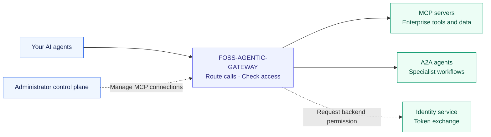
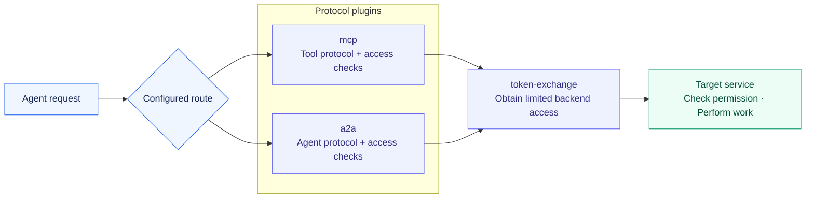
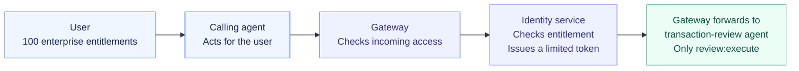

# FOSS-AGENTIC-GATEWAY

**Build the gateway your agents need. Share the capabilities everyone can use.**

AI agents need tools, other agents, and permission to act. As workflows grow, teams also need to understand what happened across those connections, control usage, and decide where requests should go. These shared concerns recur across projects.

FOSS-AGENTIC-GATEWAY is a place to solve those problems together. It provides an open gateway built on Kong OSS, with reusable plugins for MCP, A2A, and token exchange. Run it for your own workflows, improve an existing capability, or contribute the next plugin.

**Have a shared problem across your agents? Build a plugin here.** Tracing agent-to-agent calls, enforcing usage budgets, discovering tools, or choosing an LLM are examples of capabilities the community could contribute. Today's working foundation covers MCP, A2A, and token exchange.

[Try it](examples/banking/README.md) · [Build with us](CONTRIBUTING.md) · [Propose a capability](https://github.com/sanketrk/FOSS-AGENTIC-GATEWAY/issues/new) · [Deploy it](docs/gateway/setup.md)

## Why build here?

A useful solution should be able to travel beyond the team that created it. An interoperability fix, an access policy, or a routing strategy can become a reusable plugin that helps other projects.

This repository gives contributors a starting point: a working gateway, three plugins, a Python SDK, an administrator UI, and banking examples tested through real token exchange. You can work on one capability and demonstrate it alongside the others.

| For builders | For teams running agents |
| --- | --- |
| Read, adapt, and contribute Apache-2.0 source. | Host the gateway in your own infrastructure. |
| Add a focused plugin using Kong's extension mechanism. | Choose capabilities per connection. |
| Use shared examples and CI to demonstrate your change. | Connect tools and agents through a common entry point. |
| Share integrations across open protocols and agent stacks. | Keep backend credentials and access policy at the gateway. |

The aim is an open collection of useful gateway capabilities that grows through contributions. The current project is a starting point you can use and extend.



## What is available today?

| Component | What you can do |
| --- | --- |
| `mcp` plugin | Connect agents to MCP tools and check incoming access. |
| `a2a` plugin | Connect agents to other agents over JSON-RPC or REST and check incoming access. |
| `token-exchange` plugin | Obtain a separate backend token with the configured permissions. |
| Python SDK | Call the gateway and verify the required identity policy at backends. |
| Control plane | Register MCP connections, review configuration, and publish it with OIDC administrator login. |

A2A and token-exchange settings currently use deployment configuration. See the [supported profiles](docs/protocols/interoperability.md), [A2A guide](docs/protocols/a2a.md), and [SDK guide](sdk/python/README.md) for current limits.

### And Kong's many plugins?

Kong offers plugins you can use with Kong OSS and additional plugins that require a paid license. Its [OpenID Connect plugin](https://developer.konghq.com/plugins/openid-connect/) requires Kong Enterprise, and [AI Proxy Advanced](https://developer.konghq.com/plugins/ai-proxy-advanced/) requires an AI license.

**Our three project plugins are available to Kong OSS users as Apache-2.0 source in this repository.** The supplied gateway image includes them and the OSS release's bundled plugins. Compatible OSS plugins can be configured alongside them; check version support and how they interact. Each upstream plugin retains its own license.

See the [Kong Plugin Hub](https://developer.konghq.com/plugins/) for upstream availability and our [contribution guide](CONTRIBUTING.md) for installing and extending project plugins.

## Plugins make room for your next idea

Choose the behavior a connection needs. An MCP route uses the tool plugin; an A2A route uses the agent plugin. Either can add the same token-exchange plugin. That shared capability can improve without rebuilding both protocols.



*The diagram shows exchange-enabled routes. Token exchange is optional in the base gateway.*

A new capability can follow the same approach: a focused plugin, clear configuration, and an example others can run. Contributors implement, package, and test new plugins using Kong's plugin mechanism. The [contribution guide](CONTRIBUTING.md#adding-a-plugin) explains the steps.

### Build capabilities that work across workflows

An agent calling another agent creates questions that every team needs to answer: Who called whom? Which step was slow? Why did the workflow fail? What access was used? Solving those questions in a shared gateway can make the solution reusable across many agents and tools.

These are **cross-cutting concerns**: capabilities that support many workflows. Plugins give contributors a place to develop them independently and compose them with the protocol and access checks already here.

| A shared need | A contribution could enable |
| --- | --- |
| Agent-to-agent observability | Link related calls, show the path between agents, and explain latency and failures. |
| Access policy and audit | Apply additional access rules and record who called which service with what permission. |
| Usage and cost controls | Enforce configured limits or budgets across agent and tool calls. |
| Discovery and routing | Find approved agents and tools, or select an appropriate destination. |
| Model selection | Route model requests using cost, latency, capability, or data-location policy. |
| Administration and integration | Extend the control plane, support more SDK languages, and add identity integrations. |

For example, an observability contribution could demonstrate a trace across two agents and a tool call. An LLM-routing contribution could select between two approved models using a clear policy. Both start with a concrete problem and an example others can reproduce.

**These are contribution directions, not additional features shipped today.** Each needs its own design, configuration, implementation, and tests. The gateway can observe traffic that passes through it; complete workflow traces also need cooperating agents and services.

[Open a proposal](https://github.com/sanketrk/FOSS-AGENTIC-GATEWAY/issues/new) with the problem and a concrete workflow. Documentation fixes, bug reports, and interoperability tests are equally useful contributions. The [contribution guide](CONTRIBUTING.md) explains how to start.

## Give each target only the access it needs

A user may have **100 enterprise entitlements**. A transaction-review agent may need **just one**: `review:execute`.

Token exchange lets the gateway request a separate token for that target with only its configured permission. This is **downscoping**. Your identity service checks that the caller is entitled to the permission; the target validates the token before acting.



The target receives limited access, while permissions for unrelated services stay out of its token. With the appropriate identity policy, it can also identify the original caller and the gateway acting for them.

Today, requested scopes are configured per route, and the identity service owns entitlement decisions. The [token-exchange guide](docs/plugins/token-exchange.md) covers setup and enforcement.

## Try a complete banking workflow

The examples contain **two agents and two MCP servers**. A banking orchestrator reads an account summary, retrieves recent transactions, and asks a transaction-review agent to summarize a purchase. Each target receives its own limited token.

The examples use synthetic data and include a local identity service, TLS, and both A2A JSON-RPC and REST. [Run them locally →](examples/banking/README.md)

## Get started

```sh
git clone https://github.com/sanketrk/FOSS-AGENTIC-GATEWAY.git
cd FOSS-AGENTIC-GATEWAY
```

| Start here | Guide |
| --- | --- |
| Run the complete example | [Banking examples](examples/banking/README.md) |
| Contribute a fix or capability | [Contributing](CONTRIBUTING.md) |
| Configure and deploy | [Gateway setup](docs/gateway/setup.md) |
| Manage MCP connections | [Control-plane setup](docs/control-plane/setup.md) |
| Explore the code | [Gateway plugins](gateway/plugins/), [SDK](sdk/python/), [control plane](apps/control-plane/), [tests](tests/) |
| Find all guides | [Documentation index](docs/README.md) |

You supply the services, identity configuration, and deployment environment. Backends own their business logic and authorization. Production deployments also need network restrictions, monitoring, and operational policies.

## License

Use, modify, and contribute under [Apache-2.0](LICENSE). Built on Kong Gateway OSS and OpenResty. The [gateway setup guide](docs/gateway/setup.md) covers dependency licenses.
